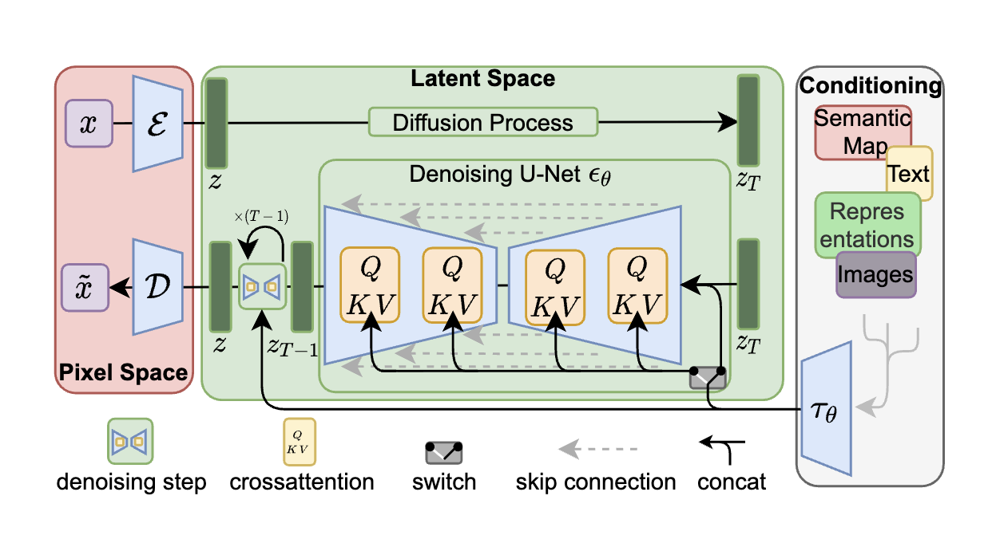

# High Resolution Image Synthesis with Latent Diffusion Models (LDM)

- Decomposing the image formation process into a sequential application of denoising autoencoders. SOTA synthesis results on image and beyong.
- DM Training on limited computational resources while retaining their quality and flexibility, the paper applies them in the latent space of powerful **pre-trained** autoencoders.
- Training DMs on such a representation allows for the first time to reach a near-optimal point between complexity reduction and detail preservation, greatly boosting visual fidelity.
- **Cross-Attention layers** into model architecture turns DMs into powerful and flexible generators for general conditioning inputs such as text or bouding boxes and high resolution synthesis becomes possible in a convolutional manner.
- As main focus is on LDM, we don't want to get into text-to-image synthesis (uses CLIP), image inpainting, class-conditional image synthesis, unconditional image generation, and most importantly **super-resolution**.
- Reducing computation requirements compared to pixel-based DMs.

Before diving into LDM, let's first understand AutoEncoders (AE) and Variational AutoEncoders (VAE).

**AutoEncoder (AE)**

An AutoEncoder is a dimensionality reduction method, similar to PCA, T-SNE, and UMAP.

**Comparison with Other Methods:**

- **PCA**: A linear dimensionality reduction technique.
- **T-SNE and UMAP**: Non-linear methods that optimize embeddings to preserve neighborhood structure, primarily used for visualization. Unlike AE, they don't learn an inverse decoder.
- **AutoEncoder**: A non-linear method focused on reconstruction. It learns an encoding that allows a decoder to rebuild the original input.

**Architecture**

An AutoEncoder is essentially a neural network with three main components:
1. **Encoder**: Compresses the input into a latent representation
2. **Bottleneck**: The compressed representation layer
3. **Decoder**: Reconstructs the output from the latent representation

**Latent Space vs Bottleneck**

It's important to distinguish between these concepts:

- **Bottleneck layer**: The specific layer (or layers) in the network that constrains information flow. It can be a single layer or multiple layers, constrained through various methods (noise, sparsity, quantization, etc).
- **Latent representation**: The compressed code produced by the encoder at the bottleneck.
- **Latent space**: The conceptual space encompassing all possible latent representations.

In summary:
- The **bottleneck** is the mechanism that enforces compression
- The **latent representation** is the compressed code itself
- The **latent space** is the space of all such codes

**Training Objective**

A high-quality latent space is achieved by optimizing for reconstruction quality, typically using MSE loss to measure pixel-level differences between input and output.

---

**Variational AutoEncoder (VAE)**

A VAE extends the standard AutoEncoder by adding a probabilistic structure to the latent space.

**Key Differences from AE:**

- **Standard AE**: Maps each input to a single point in latent space (deterministic encoding).
- **VAE**: Maps each input to a distribution in latent space (probabilistic encoding).

**Architecture**

The VAE has the same three components as an AE, but with a crucial modification:

1. **Encoder**: Outputs parameters of a distribution (typically mean $\mu$ and variance $\sigma^2$) instead of a single latent vector
2. **Sampling**: Samples from this distribution using the reparameterization trick: $z = \mu + \sigma \odot \epsilon$, where $\epsilon \sim \mathcal{N}(0, 1)$.
3. **Decoder**: Reconstructs the output from the sampled latent vector

**Loss Function**

The VAE loss combines two objectives:

- **Reconstruction loss**: Measures how well the output matches the input (MSE or BCE)
- **KL divergence**: Regularizes the latent space by encouraging the learned distribution to be close to a standard normal distribution N(0,1)

Total loss: L = Reconstruction Loss + β × KL Divergence

**Why VAE?**

The VAE's probabilistic nature provides two key advantages:

1. **Smooth latent space**: Similar inputs map to nearby distributions, creating a continuous and interpolatable latent space
2. **Generation capability**: We can sample random points from N(0,1) and decode them to generate new, realistic samples

This makes VAE ideal for generative tasks, which is why it's used in Latent Diffusion Models.

The paper to refer to is the Kingma paper (1) (I have written notes and learnt a lot from this - mainly about the Variational Inference).

---

## LDM

- High-resolution synthesis:
  1. Likelihood-based Models: AutoRegressive (AR) transformers (4, 5).
  2. GANs: Promising results, however mostly confined to data with comparably limited variability as the adversarial learning procedure does not easily scale to modeling complex, multi-modal distributions.

DMs belong to the class of likelihood-based models.

I saw the same bits/dim in the DDPM and now in LDM paper as well. Rate-Distortion trade-off.

### Two Stage Training

1. Perceptual compression stage: Removes high-frequency details but still learns little semantic variation.
2. Actual Generative Model: Learns the semantic and conceptual composition of the data (semantic compression).

* First Stage - Train autoencoder which provides a lower dimensional (and thereby efficient) representational space which is perceptually equivalent to the data space.
* Second Stage - Train DM in the learned latent space, which exhibits better scaling properties with respect to the spatial dimensionality.

We just have to train the autoencoding stage only once and can therefore reuse it for multiple DM trainings or to explore possibly completely different tasks.

### Method

DMs still requires a costly function evaluations in pixel space, which causes huge demands in computation time and energy resources.

To circumvent the drawback, we have to seperate the **compressive** and the **generative learning** phases.

So, we first utilize the autoencoding model which learns a space that is perceptually equivalent to the image space, but offers significantly reduced computational complexity.

Now we get DMs that are computationally much more efficient because sampling is performed on a low-dimensional space. We have the same powers of inductive bias that is inherited from the DMs from their U-NET architecture using convolutions which makes them particularly effective for data with spatial strucure and therefore alleviates the need for aggressive, quality-reducing compression levels. We can use the same latent space to train multiple generative models and which can be utilized for other downstream applications such as single-image CLIP guided synthesis.

The perceptual compression model consists of an autoencoder trained by combination of a perceptual loss and a patch-based adversarial objective. This ensures that the reconstructions are confined to the image manifold by enforcing local realism and avoids bluriness introduced by relying solely on pixel-space losses such as $L_2$ and $L_1$ objectives.

When an image $x \in \mathbb{R}^{H \times W \times 3}$ in RGB space, the encoder $\mathcal{E}$ encodes $x$ into a latent representation $z = \mathcal{E}(x)$, and the decoder $\mathcal{D}$ reconstructs the image from the latent, giving $\tilde{x} = \mathcal{D}(z) = \mathcal{D}(\mathcal{E}(x))$, where $z \in \mathbb{R}^{h \times w \times c}$.

The encoder downsamples the image by a factor $f = H/h = W/w$, and we investigate different downsampling factors $f = 2^m$, with $m \in \mathbb{N}$.

So as to avoid arbitrarily high-variance latent spaces, the paper experiments with two differnt kinds of regularizations.

1. The first variant - KL-Regularization, imposes a slight KL-penalty towards a standard normal on the learned latent, similar to a VAE (1).
2. The second variant - VQ-regularized, uses a vector quantization layer within the decoder. This can be interpreted as a VQGAN but with the quantization layer absorbed by the decoder.

With the diffusion model and the autoencoder combined we get a reformed reweighted bound which reads as:

$$
L_{LDM} = \mathbb{E}_{\mathcal{E}(x), \epsilon \sim \mathcal{N}(0, 1), t}  \left[ \parallel \epsilon - \epsilon_\theta (z_t, t) \parallel_2^2 \right]
$$

The neural backbone $\epsilon_\theta(\circ, t)$ is considered as a time-conditional UNET.

Since the forward process is fixed, $z_t$ can be efficiently obtained from $\mathcal{E}$ during training, and samples from $p(z)$ can be decoded to image space with a single pass through $\mathcal{D}$.

There is this conditional generation mechanisms for tasks like image to image, inpainting, text to image and others which require this conditional mechanism.

---

## References

1. https://arxiv.org/abs/1312.6114 - Auto-Encoding Variational Bayes - I have studied this and have written notes in my notebook.
2. https://arxiv.org/abs/2006.11239 - Denoising Diffusion Probabilistic Models
3. https://arxiv.org/abs/1503.03585 - Deep Unsupervised Learning using Nonequilibrium Thermodynamics
4. https://arxiv.org/abs/2102.12092 - Zero-Shot Text-to-Image Generation
5. https://arxiv.org/abs/1906.00446 - Generating Diverse High-Fidelity Images with VQ-VAE-2
6. https://arxiv.org/abs/2106.05931 - Score-based Generative Modeling in Latent Space
7. https://arxiv.org/abs/2012.09841 - Taming Transformers for High-Resolution Image Synthesis